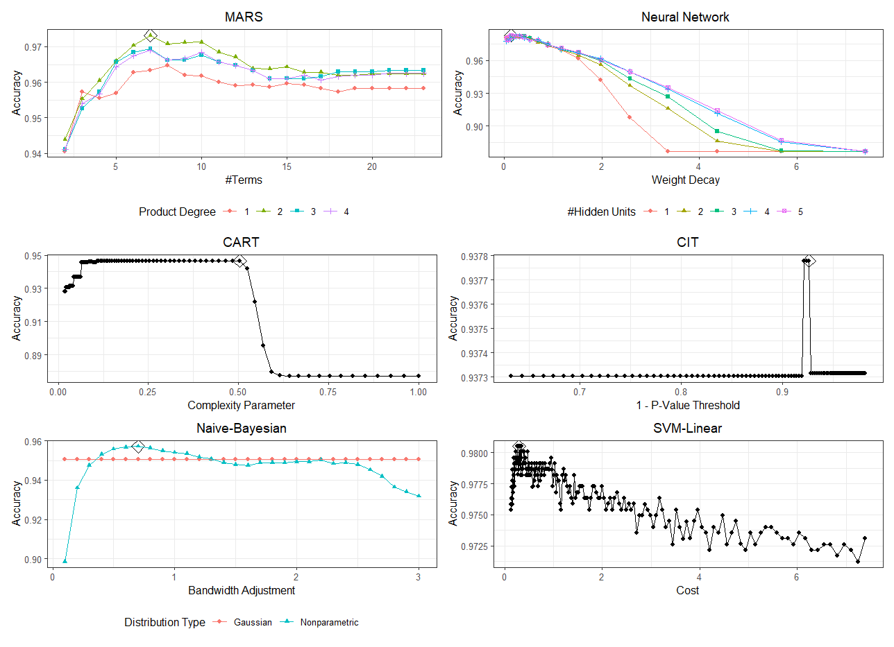
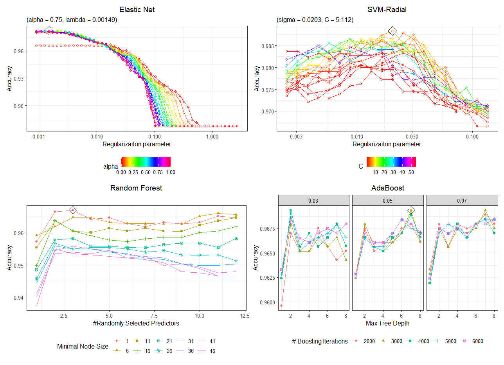

```{r setup, include=FALSE}
knitr::opts_chunk$set(echo = FALSE, warning = F, message = F)
```

# 1 Introduction

## 1.1 Data Source

The original purpose of the research where the data set was built was to replace liver biopsy for disease staging. In the study, multiple serum markers in this dataset are under evaluation with multi-parametric panels yielding the most promising results\(^{1,2}\).

## 1.2 Motivation

According to the Centers for Disease Control and Prevention (CDC): Hepatitis C is a liver infection caused by the hepatitis C virus (HCV). Hepatitis C is spread through contact with blood from an infected person. Today, most people become infected with the hepatitis C virus by sharing needles or other equipment used to prepare and inject drugs. For some people, hepatitis C is a short-term illness, but for more than half of people who become infected with the hepatitis C virus, it becomes a long-term, chronic infection. Chronic hepatitis C can result in serious, even life-threatening health problems like cirrhosis and liver cancer. People with chronic hepatitis C can often have no symptoms and don’t feel sick. When symptoms appear, they often are a sign of advanced liver disease. There is no vaccine for hepatitis C. The best way to prevent hepatitis C is by avoiding behaviors that can spread the disease, especially injecting drugs. Getting tested for hepatitis C is important, because treatments can cure most people with hepatitis C in 8 to 12 weeks\(^{3}\).

Creating a predictive model that could perform early detection of Hepatitis C and other liver diseases would allow people to quickly and easily determine their risk/get treatment.

## 1.3 Data Description

The data contains 615 observations and 13 attributes of blood donors and Hepatitis C patients laboratory (10 laboratory results) and demographic values (age and gender), as well as a subject Category indicator. All attributes except the outcome indicator Category (blood donors vs. Hepatitis C, including its progress-Hepatitis C, Fibrosis, Cirrhosis) and Sex are numerical. Package `tydiverse` were used to clean data and transform data types for analysis convenience, package `caret` were used to partitioning data to training and testing set, 70% of the data to be train data and the 30% rest to be test data. I investigated for abnormal values in laboratory values, as well as the missing data. The descriptive analysis is shown in Table 1.

```{r, echo=FALSE}
library(gtsummary)
library(tidyverse)
hcv <- read.csv("HepatitisCdata.csv")[,-1]
hcv %>%
  tbl_summary(by = Category, missing_text = "Missing/NA") %>%
  add_p(pvalue_fun = ~style_pvalue(.x, digits = 2)) %>%
  add_overall() %>%
  add_n() %>%
  modify_header(label ~ "**Variable**") %>%
  modify_spanning_header(c("stat_1", "stat_2") ~ "**Subject Type**") %>%
  modify_footnote(
    all_stat_cols() ~ "Median (IQR) or Frequency (%)"
  ) %>%
  modify_caption("**Summary of Dataset**")
```

# 2 Exploratory analysis/visualization

## TODO

# 3 Modeling

## 3.1 Data Preprocessing

The data is already prepared in .csv table format. However, the dataset has 31 missing values and we consider them to be missing-at-random (MAR). We implemented 5-nearest neighbor imputation on the original data to accommodate those missing values, then applied Box Cox transformation and standardization (center and scale) to re-scale the numerical covariates so they are approximately normally distributed. This normalization helps us reduce the influence from outliers and achieve better classification result.

## 3.2 Predictors

In the modeling part, all variables were included and there wasn't variable selection procedure prior to modeling process. The target response variable is Category, which was recoded as 0 and 1, representing healthy blood donors and kinds of liver diseases patients.

Specifically, here shows the predictors in the models:
(1) `Age`: age of the patient in years;
(2) `Sex`: sex of the patient;
(3) `ALB`: amount of albumin in patient's blood;
(4) `ALP`: amount of alkaline phosphatase in patient's blood;
(5) `ALT`: amount of alanine transaminase in patient's blood;
(6) `AST`: amount of aspartate aminotransferase in patient's blood;
(7) `BIL`: amount of bilirubin in patient's blood;
(8) `CHE`: amount of cholinesterase in patient's blood;
(9) `CHOL`: amount of cholesterol in patient's blood;
(10) `CREA`: amount of creatine in patient's blood;
(11) `GGT`: amount of gamma-glutamyl transferase in patient's blood;
(12) `PROT`: amount of protein in patient's blood;

## 3.2 Used Techniques

Since the traditional approach in HCV diagnostic pathways is related to decision tree, two tree methods were used: the conditional inference trees (CTREE) and regression tree (RPART). The tree methods can be displayed graphically and more easily understood by physicians. Taking the diagnosis of HCV as a classification problem, other machine learning models were also trained for the purpose our project. We used the generalized additive model model (GAM), the generalized linear regression models, GLMNET (with penalization) and GLM (without penalization), linear and quadratic discriminant analysis models (LDA, QDA), as well as naive bayes (NB). We also added black-box models, including ensemble models random forest (RF) and adaboost model, support vector machine (SVM) models with linear and radial kernel, as well as the neural network (NN) model. 
All the models were trained using the package `caret`. The regression models (GLM, LDA, etc. al.) can accept mixture of variables which is suitable for our case. NB is useful when predictor number is large. GAM model can include any quadratically penalized GLM and a variety of other models, which induces great flexibility. Linear regression model also assumed the independence of the predictors. The black-box models are more complicated and are expected to have better performance.

## 3.3 Parameters Tuning

The tuning parameters are tested via the train function of the `caret` package. We looked for the point where the best cross-validated training accuracy is obtained.

* *GLMNET Model*: We tested on different ranges of regularization parameter $\lambda$ and $\alpha$. The result is `alpha = 0.75` (selected via minimum rule), and `lambda = 0.0015`.

* *MARS Model*: MARS model can take a wide degree of features and number of terms. For simplicity, we only consider the performance of MARS in the first four degrees and all terms. The best tuned parameter is `degree = 2` and `nprune = 7`.

* *NB and Tree models*: NB is trained by the Laplace correction parameter and the kernel density estimates. The CTREE is trained by minicriterion and RPART is trained by the complexity parameter (cp). The results are: `Laplace correction(FL) = 1`, `adjust = 1.7` for NB model, `minicriterion = 0.86` for CTREE model, and `cp = 0.050` for the RPART model. 

* *RF and Adaboost Model*: RF and Adaboost are black-box ensemble methods. RF is trained by number of trees and minimum node size. The best tuned number of trees is 3, and minimum node size of 1 with gini split rule. Adaboost is trained via number of trees, tree depth and learning rate. The best tuned parameter is number of trees equals 3000, with tree depth of 7 and learning rate 0.05. 

* *SVM models with linear and radial kernel*: Linear kernel SVM model is tuned with the penalty associated with having an observation on the wrong side of the classification boundary. The best tuned cost is 0.30. Radial kernel SVM is tuned with an additional sigma parameter for kernel function, and the best tuned value is 0.020.

* *Neural Network Model*: The best tuned neural network model has 5 hidden units and a decay rate of 0.14.

```{r tuning_plot1, echo=FALSE, out.width = '90%', fig.align='center'}

```

```{r tuning_plot2, echo=FALSE, out.width = '90%', fig.align='center'}

```

## 3.4 Training Performance

We address the performance of each model by the repeated 10-folds cross-validation accuracy scores based on the training set. We also look at the `kappa` value that ranges from -1 to 1, which measures how well the classification performs compared to random classifier. Therefore for both accuracy and `kappa`, the larger the better.

```{r training_accuracy}
accuracy_plot <- readRDS("./accuracy.rds");accuracy_plot
```

As shown in the figure above, all of the models perform generally well. The best model with highest accuracy and highest kappa is the support vector machine model with radial kernel. It worth notice that the traditionally used tree methods were not outstanding comparing with the other models. 

## 3.5 Test performance

For test performance, we address the performance of each model by its error rate. 

```{r test_performance}
kable_out <- readRDS("error_rate.rds")
kable_out %>% knitr::kable(col.names = c("Models", "Testing Error Rate"), digits = 5, caption = "Testing Error Rate")
```

Not surprisingly, the SVM models has the smallest error rate of 0.02174 i.e. accuracy of 0.9783, therefore they have the best performance in prediction among all the models. 

## 3.6 Variable Importance

# 4 Limitations

Our dataset is imbalanced. The rare disease outcome may cause our model to underestimate the potential effect of some predictors. In the data preprocessing step, we assume data are missing-at-random but we never know whether this is the true scenario. Also, the models are trained and tested on normalized data for better classification results. However, it is hard to interpret the relationship between original values of covaraiate and the disease outcome based on the normalized data i.e. reduced interpretability. Last but not least, in terms of interpretability, support vector machine is limited comparing with regression and tree-based methods. They may be hard for physicians to tell their biological meaning.

# 5 Conclusion

We select the model with the best cross validation training accuracy. According to the plot in 3.4, the support vector machine model (SVM) with radial kernel has the highest median cross-validated accuracy among all models, and it also has a `kappa` value close to one and a good performance on testing set (lowest error rate).

However, SVM models are lack of interpretability. It is hard to tell the relationship between covariates and the disease outcome only via SVM and therefore not so helpful clinically. The logistic regression model, GLMNET, has a much better interpretability and also relatively good performance on training and testing accuracy (top 3). The parameters of the GLMNET model is listed below:

```{r glmnet_para}
model.glmn <- readRDS("models/model.glmn.rds")
sparse.matrix <- coef(model.glmn$finalModel, model.glmn$bestTune$lambda)
sparse.matrix[,1] %>% knitr::kable(col.names = c("Coefficients"), 
                                   caption = "GLMNET Coefficients")
```

We see that the amount of aspartate aminotransferase (`AST`), bilirubin (`BIL`), cholinesterase (`CHE`), creatine (`CREA`), gamma-glutamyl transferase (`GGT`) and protein in patient's blood (`PROT`) are positively related with the HCV disease. Other covariates including the gender being male, the amount of albumin (`ALB`), alkaline phosphatase (`ALP`), alanine transaminase (`ALT`) and cholesterol (`CHOL`) in patient's blood are negatively related with the disease. And `Age` does not appear to be a important factor in the diagnosis of HCV. 

However, the coefficients does not necessarily justifies that there are causal relationship between these chemicals and the HCV disease, as further experiments are needed to prove that. 

Therefore we select the SVM model with radial kernel to be our final model with the best performance, and the GLMNET model to be our final model when taking the data interpretability into account. They are the best models in diagnosing HCV disease (in an early stage) based on laboratory results among all models we have tested.

# 6 Bibliography

1. Hoffmann, G., Bietenbeck, A., Lichtinghagen, R., & Klawonn, F. (2018). Using machine learning techniques to generate laboratory diagnostic pathways—a case study. Journal Of Laboratory And Precision Medicine, 3(6).

2. Lichtinghagen, R., Pietsch, D., Bantel, H., Manns, M. P., Brand, K., & Bahr, M. J. (2013). The Enhanced Liver Fibrosis (ELF) score: normal values, influence factors and proposed cut-off values. Journal of hepatology, 59(2), 236–242. https://doi.org/10.1016/j.jhep.2013.03.016

3. https://www.cdc.gov/hepatitis/hcv/index.htm

# 7 Appendix
