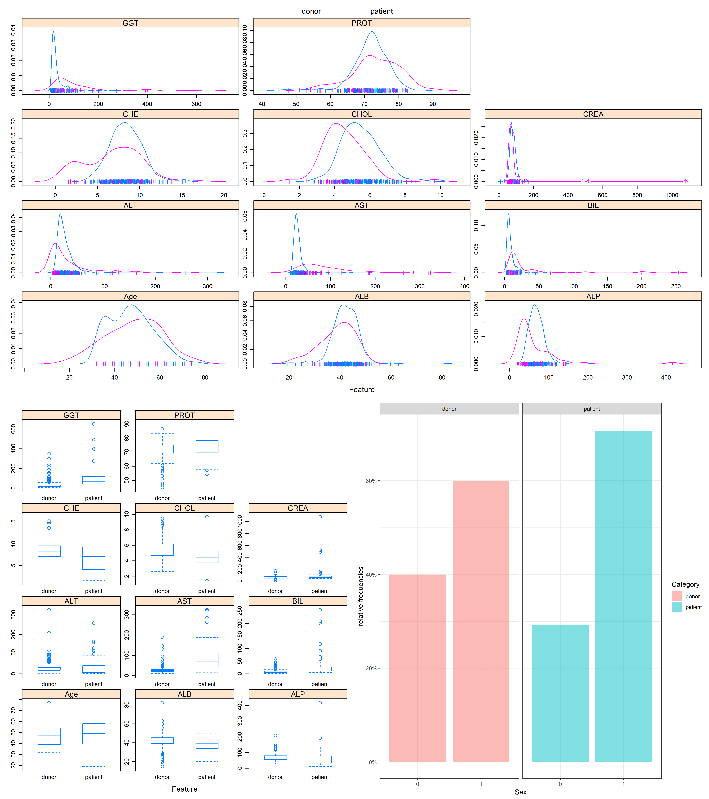
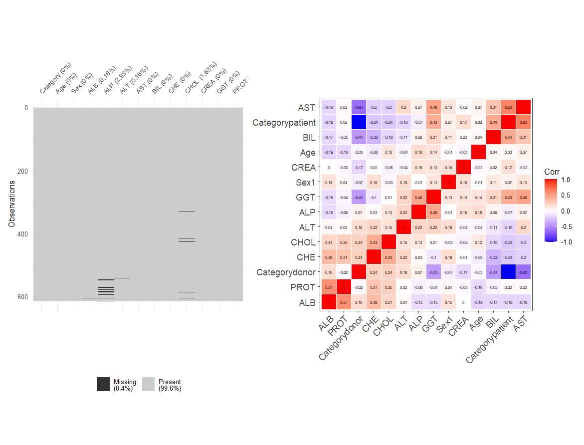
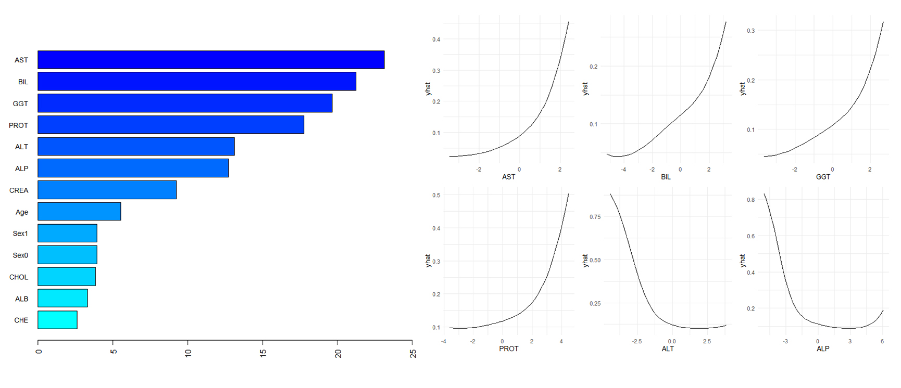
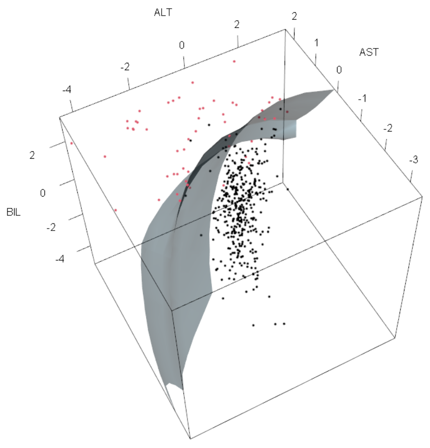

```{r setup, include=FALSE}
knitr::opts_chunk$set(echo = FALSE, warning = F, message = F)
```
\pagebreak
# 1 Introduction

## 1.1 Data Source

The original purpose of the research where the data set was built was to replace liver biopsy for disease staging. In the study, multiple serum markers in this dataset are under evaluation with multi-parametric panels yielding the most promising results\(^{1,2}\).

## 1.2 Motivation

According to the Centers for Disease Control and Prevention (CDC): Hepatitis C is a liver infection caused by the hepatitis C virus (HCV). Hepatitis C is spread through contact with blood from an infected person. Today, most people become infected with the hepatitis C virus by sharing needles or other equipment used to prepare and inject drugs. For some people, hepatitis C is a short-term illness, but for more than half of people who become infected with the hepatitis C virus, it becomes a long-term, chronic infection. Chronic hepatitis C can result in serious, even life-threatening health problems like cirrhosis and liver cancer. People with chronic hepatitis C can often have no symptoms and don’t feel sick. When symptoms appear, they often are a sign of advanced liver disease. There is no vaccine for hepatitis C. The best way to prevent hepatitis C is by avoiding behaviors that can spread the disease, especially injecting drugs. Getting tested for hepatitis C is important because treatments can cure most people with hepatitis C in 8 to 12 weeks\(^{3}\).

Creating a predictive model that could perform early detection of Hepatitis C and other liver diseases would allow people to quickly and easily determine their risk/get treatment.

## 1.3 Data Description

The data contains 615 observations and 13 attributes of blood donors and Hepatitis C patients laboratory (10 laboratory results) and demographic values (age and gender), as well as a subject Category indicator. All attributes except the outcome indicator Category (blood donors vs. Hepatitis C, including its progress-Hepatitis C, Fibrosis, Cirrhosis) and Sex are numerical. Package `tydiverse` were used to clean data and transform data types for analysis convenience, package `caret` were used to partitioning data to training and testing set, 70% of the data to be train data and the 30% rest to be test data. We investigated for abnormal values in laboratory values, as well as the missing data. The descriptive analysis is shown in Table 1.

```{r, echo=FALSE}
library(gtsummary)
library(tidyverse)
hcv <- read.csv("HepatitisCdata.csv")[,-1]
hcv %>%
  tbl_summary(by = Category, missing_text = "Missing/NA") %>%
  add_p(pvalue_fun = ~style_pvalue(.x, digits = 2)) %>%
  add_overall() %>%
  add_n() %>%
  modify_header(label ~ "**Variable**") %>%
  modify_spanning_header(c("stat_1", "stat_2") ~ "**Subject Type**") %>%
  modify_footnote(
    all_stat_cols() ~ "Median (IQR) or Frequency (%)"
  ) %>%
  modify_caption("**Summary of Dataset**")
```

# 2 Exploratory analysis/visualization

In this section, we used the function `featurePlot()` in caret to visualize the continuous variables and the only binary predictor Sex in the original dataset. The Sex is plotted as a continuous variable for simplicity.
The feature plots shows that the some of the continuous predictors are almost normal, like CHOL and ALB. 

From **Figure 1**, we can explore the difference in distributions between patients and donors. For GGT, AST, BIL, CHE, PROT, and ALT, the patients seem to have a wider distribution than the donors, which means that there might be more variability among patients. As for CHOL and ALP, the shape of the distributions between two groups, but there are a shift in distributions between two groups, that indicates that the level of serum biomarkers between two groups may be different.

The rest of the continuous variables do not show a clear difference. The percentage bar plot of Sex shows that the percentage of the male is higher in the patient group.

```{r EDA_1, echo=FALSE, out.width = '90%', fig.align='center'}

```
\begin{center}
Figure 1. Distributions of Features in Two Categories
\end{center}

We found that there are 31 missing values in the dataset, we assumed that the missing to be missing-at-random (MAR), and we will implement impute method with Box-Cox transformation before we train the models.

We also investigated the multicollinearities. From **Figure 2**, we found that the highest correlation is between AST and Category: Patient (with a correlation of 0.63), followed by the correlation between ALB and PROT (0.57). The correlation between AST and the response variable is intriguing, which indicates that the level of serum AST might have a close relation to liver diseases.

```{r EDA_2, echo=FALSE, out.width = '90%', fig.align='center'}

```
\begin{center}
Figure 2. Missing Data Plot and Correlation Plot
\end{center}

# 3 Modeling

## 3.1 Data Preprocessing

The data is already prepared in .csv table format. However, the dataset has 31 missing values and we consider them to be missing-at-random (MAR). We implemented a 5-nearest neighbor imputation on the original data to accommodate those missing values, then applied Box-Cox transformation and standardization (center and scale) to re-scale the numerical covariates so they are approximately normally distributed. This normalization helps us reduce the influence of outliers and achieve better classification results.

## 3.2 Predictors

In the modeling part, all variables were included and there wasn't a variable selection procedure prior to the modeling process. The target response variable is Category, which was recoded as 0 and 1, representing healthy blood donors and kinds of liver disease patients.

Specifically, here shows the predictors in the models:
(1) `Age`: age of the patient in years;
(2) `Sex`: sex of the patient;
(3) `ALB`: amount of albumin in patient's blood;
(4) `ALP`: amount of alkaline phosphatase in patient's blood;
(5) `ALT`: amount of alanine transaminase in patient's blood;
(6) `AST`: amount of aspartate aminotransferase in patient's blood;
(7) `BIL`: amount of bilirubin in patient's blood;
(8) `CHE`: amount of cholinesterase in patient's blood;
(9) `CHOL`: amount of cholesterol in patient's blood;
(10) `CREA`: amount of creatine in patient's blood;
(11) `GGT`: amount of gamma-glutamyl transferase in patient's blood;
(12) `PROT`: amount of protein in patient's blood;

## 3.2 Used Techniques

Since the traditional approach in HCV diagnostic pathways is related to decision trees, two tree-based methods were used: the conditional inference trees (CTREE) and regression tree (RPART). The tree-based methods can be displayed graphically and more easily understood by physicians. Taking the diagnosis of HCV as a classification problem, other machine learning models were also trained for the purpose of our project. We used the generalized additive model (GAM), the generalized linear regression models, GLMNET (with penalization) and GLM (without penalization), and linear and quadratic discriminant analysis models (LDA, QDA), as well as naive Bayes (NB). We also added black-box models, including ensemble models random forest (RF) and boosting (AdaBoost) model, support vector machine (SVM) models with the linear and radial kernel, as well as the neural network (NN) model. 
All the models were trained using the package `caret`. The regression models (GLM, LDA, etc. al.) can accept a mixture of variables that is suitable for our case. NB is useful when the predictor number is large. GAM model can include any quadratically penalized GLM and a variety of other models, which induces great flexibility. The linear regression model also assumed the independence of the predictors. The black-box models are more complicated and are expected to have better performance.

## 3.3 Parameters Tuning

The tuning parameters are tested via the train function of the `caret` package. We looked for the point where the best cross-validated training accuracy is obtained. All the tuning plots are shown in Figure 3.

* *GLMNET Model*: We tested on different ranges of regularization parameter $\lambda$ and $\alpha$. The result is `alpha = 0.75` (selected via minimum rule), and `lambda = 0.0015`.

* *MARS Model*: MARS model can take a wide degree of features and number of terms. For simplicity, we only consider the performance of MARS in the first four degrees and all terms. The best tuned parameter is `degree = 2` and `nprune = 7`.

* *NB and Tree models*: NB is trained by the Laplace correction parameter and the kernel density estimates. The CTREE is trained by minicriterion and RPART is trained by the complexity parameter (cp). The results are: `Laplace correction(FL) = 1`, `adjust = 1.7` for NB model, `minicriterion = 0.86` for CTREE model, and `cp = 0.050` for the RPART model. 

* *RF and AdaBoost Model*: RF and AdaBoost are black-box ensemble methods. RF is trained by number of trees and minimum node size. The best tuned number of trees is 3, and minimum node size of 1 with Gini split rule. AdaBoost is trained via number of trees, tree depth and learning rate. The best tuned parameter is number of trees equals 3000, with tree depth of 7 and learning rate 0.05. 

* *SVM models with linear and radial kernel*: An SVM with a linear kernel (support vector classifier) is tuned with the penalty C which determines the number and severity of the violations to the margin (and to the hyperplane) that we will tolerate. The tuning range is set to $[e^{-2},e^2]$ and the best C selected by cross-validation is $e^{-1.34}=0.263$. An SVM with a radial kernel is tuned with an additional $\gamma$ parameter(Sigma in kernlab) for kernel function. The larger the $\gamma$, the more flexible and non-linear the machine is. The tuning ranges are $C \in [e^{-1},e^4], \gamma \in [e^{-6},e^{-2}]$, and the best values selected by cross-validation are $C=e^{1.24}=3.473$ and $\gamma=e^{-3.55}=0.029$.

* *Neural Network Model*: The best tuned neural network model has 5 hidden units and a decay rate of 0.14.

```{r tuning_plot1, echo=FALSE, out.width = '90%', fig.align='center'}

```

```{r tuning_plot2, echo=FALSE, out.width = '90%', fig.align='center'}

```
\begin{center}
Figure 3. Tuning Parameter Plots
\end{center}

## 3.4 Training Performance

We address the performance of each model by the repeated 10-folds cross-validation accuracy scores based on the training set, repeated 5 times. We also look at the `kappa` value that ranges from -1 to 1, which measures how well the classification performs compared to a random classifier. Therefore for both accuracy and `kappa`, the larger the better.

```{r training_accuracy}
accuracy_plot <- readRDS("./accuracy.rds");accuracy_plot
```
\begin{center}
Figure 4. Repeated Cross-Validation Accuracy Plots
\end{center}

As shown in the figure above, all of the models perform generally well. The best model with the highest accuracy and highest kappa is the support vector machine with a radial kernel, thus selected as our final model. It is worth noticing that the traditionally used tree methods were not outstanding compared with the other models. 

## 3.5 Test performance

For test performance, we address the performance of each model by its error rate. 

```{r test_performance}
kable_out <- readRDS("error_rate.rds")
kable_out %>% knitr::kable(col.names = c("Models", "Testing Error Rate"), digits = 5, caption = "Testing Error Rate")
```

All the models perform quite well in this study, with test error rates lower than 0.05. Not surprisingly, the SVMs have the smallest error rate of 0.02174 i.e. the accuracy of 0.9783, therefore they have the best performance in prediction among all the models. The second tier includes GAM, RF, AdaBoost, and NN models, which are all flexible or ensemble models, with an error rate of 0.02717 i.e. an accuracy of 0.9728. The general outperforming of more flexible models over linear-based and simpler models could indicate some underlying non-linear relationships in our data.

## 3.6 Variable Importance

Our final selected model support vector machine (SVM) with a radial kernel is a black-box model, so we use variable importance and partial dependence plots for interpretation. The partial dependences are calculated with the ad hoc probabilities since the SVM algorithm does not give probability predictions. 

```{r vip, echo=FALSE, out.width = '95%', fig.align='center'}

```
\begin{center}
Figure 5. Variable Importance Plot and Partial Dependence Plot of SVMR
\end{center}

Figure 5 indicates that the amount of AST contributes the most to the ensemble model among all the predictors. The greater the AST level, the higher chance of being classified as having a liver disease. BIL, GGT, PROT, ALT, and ALP are also main contributing variables in our model. When holding other variables fixed, higher amounts of BIL, GGT, PROT, and lower amounts of ALT and ALP also suggest liver diseases.

## 3.7 Model Visualization

We select three significant variables: AST, BIL (both with a positive effect), and ALT (with a negative effect) to visualize our final SVM classifier, holding other variables fixed. Figure 6 shows an obvious non-linear decision boundary, which does a good job classifying patients (red dots) from donors (black dots).

```{r classifier, echo=FALSE, out.width = '60%', fig.align='center'}

```
\begin{center}
Figure 6. SVM Classification Plot
\end{center}

# 4 Limitations

Our dataset is imbalanced. The rare disease outcome may cause our model to have a high no information rate and underestimate the potential effect of some predictors. In the data preprocessing step, we assume data are missing-at-random, but we never know whether this is the true scenario. Also, for simplicity, this study only considered two response category, future works should be done in multiclass classification tasks. The models are trained and tested on normalized data for better classification results. However, it becomes harder to interpret the relationship between original values of covariates and the disease outcomes based on the normalized data i.e. reduced interpretability. Last but not least, in terms of interpretability, the support vector machine is limited compared with regression and tree-based methods. It may be hard for physicians to tell their biological meaning.

# 5 Conclusion

We select the model with the highest training cross-validation accuracy. According to the plot in 3.4, the support vector machine (SVM) with a radial kernel has the highest median cross-validated accuracy among all models and a good performance on the testing set (lowest error rate), and it also has a `kappa` value close to one, which indicates that the inter-rater agreement is high, even accounting for the
possibility of agreement by chance.

Based on the final model we selected, as well as a comprehensive assessment of other models, we can conclude that the amount of certain proteins and amino acids in the patient’s blood is a good indicator of their risk of liver disease. However, SVM, as a non-parametric black-box model, lacks interpretability. It is hard to tell the relationship between covariates and the disease outcome only via SVM and therefore not so helpful clinically. The logistic regression model, GLMNET, has much better interpretability and also a relatively good performance on training and testing accuracy (top 3). The parameters of the GLMNET model are listed below:

```{r glmnet_para}
model.glmn <- readRDS("models/model.glmn.rds")
sparse.matrix <- coef(model.glmn$finalModel, model.glmn$bestTune$lambda)
sparse.matrix[,1] %>% knitr::kable(col.names = c("Coefficients"), 
                                   caption = "GLMNET Coefficients")
```

We see that the amount of aspartate aminotransferase (`AST`), bilirubin (`BIL`), cholinesterase (`CHE`), creatine (`CREA`), gamma-glutamyl transferase (`GGT`) and protein in patient's blood (`PROT`) are positively related with the HCV disease. Other covariates including the gender being male, the amount of albumin (`ALB`), alkaline phosphatase (`ALP`), alanine transaminase (`ALT`) and cholesterol (`CHOL`) in patient's blood are negatively related with the disease. And `Age` does not appear to be a important factor in the diagnosis of HCV. 

However, the coefficients do not necessarily justify that there is a causal relationship between these chemicals and the HCV disease, as further experiments are needed to prove that. 

Therefore we select the SVM model with a radial kernel to be our final model with the best performance, and the GLMNET model to be our final model when taking the data interpretability into account. They are the best models for diagnosing HCV disease (in an early stage) based on laboratory results among all models we have tested.

# 6 Bibliography

1. Hoffmann, G., Bietenbeck, A., Lichtinghagen, R., & Klawonn, F. (2018). Using machine learning techniques to generate laboratory diagnostic pathways—a case study. Journal Of Laboratory And Precision Medicine, 3(6).

2. Lichtinghagen, R., Pietsch, D., Bantel, H., Manns, M. P., Brand, K., & Bahr, M. J. (2013). The Enhanced Liver Fibrosis (ELF) score: normal values, influence factors and proposed cut-off values. Journal of hepatology, 59(2), 236–242. https://doi.org/10.1016/j.jhep.2013.03.016

3. https://www.cdc.gov/hepatitis/hcv/index.htm

# 7 Appendix


